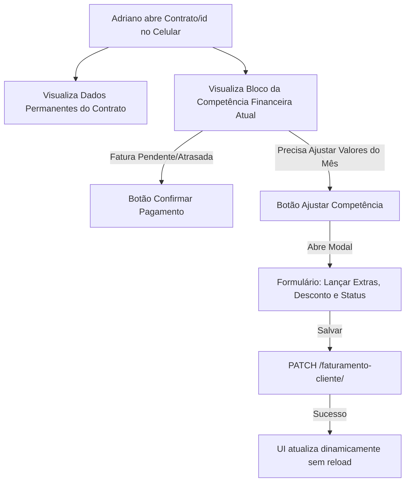
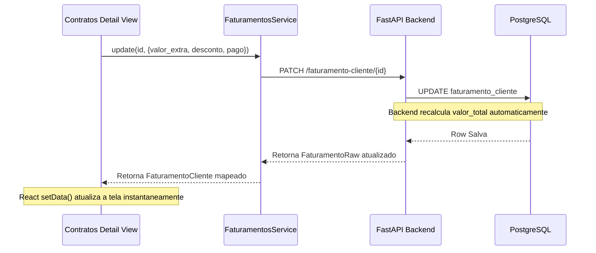

# Análise Técnico-Arquitetural — Separação Conceitual & Faturamento Ativo

Esta análise detalha a viabilidade, impactos, fluxos de UX e roteiro técnico para a evolução operacional do módulo financeiro da AM Consultoria, com foco estrito em **coerência semântica e separação de domínio**, mantendo o banco de dados, migrations, models lógicos do PostgreSQL e a identidade visual global do sistema 100% imutáveis.

---

## 1. Avaliação Arquitetural da Proposta

A proposta de desacoplar o **Contrato** (estrutura perene de escopo) do **Faturamento** (competência operacional mensal) é de altíssima maturidade arquitetural e se conecta perfeitamente ao design já existente do backend:

*   **Aderência ao Modelo PostgreSQL**: A tabela `faturamento_cliente` (definida na migração [V014](file:///c:/Users/Windows-SSD/Desktop/Am-Consultoria/database/migrations/V014__create_table_faturamento_cliente.sql)) **já nasceu semanticamente independente**. Ela possui chave primária dedicada (`id_faturamento`), relação de FK com o contrato (`id_contrato`), competência temporal (`mes_ano`) e campos isolados de operação (`valor_base`, `valor_extra`, `desconto`, `valor_total`).
*   **Capacidade de Escrita Nativa**: A API do FastAPI já possui o endpoint `PATCH /faturamento-cliente/{id_faturamento}` que atualiza de forma isolada os campos da competência e recalcula dinamicamente no banco:
    $$\text{valor\_total} = \text{valor\_base} + \text{valor\_extra} - \text{desconto}$$
*   **Desacoplamento de Ciclo de Vida**: O Contrato rege as obrigações a longo prazo. A Competência Financeira absorve a volatilidade do campo (visitas extras que Adriano precisou realizar emergencialmente, descontos concedidos devido a intempéries operacionais, status de liquidação do Pix). 
*   **Veredito**: A arquitetura do backend já está totalmente preparada. O frontend atual é que subutilizava essa divisão, tratando o faturamento apenas como uma linha informativa. A evolução solicitada fechará essa lacuna de forma extremamente segura e elegante.

---

## 2. Impactos Positivos e Riscos

### Impactos Positivos:
1.  **Preservação da Rastreabilidade Contratual**: Adriano pode conceder um desconto de R$ 500,00 na competência de junho (ex: cortesia comercial) sem precisar alterar o contrato base ou gerar um replace/timeline fake. O histórico do contrato permanece íntegro.
2.  **Agilidade Operacional de Campo**: Com dois toques no celular, Adriano lança um valor extra de R$ 300,00 referente a uma visita emergencial do mês atual e o faturamento se recalcula instantaneamente, gerando a cobrança exata.
3.  **Higiene Conceitual**: Adriano deixa de confundir "reajuste financeiro" (que muda a mensalidade permanente do contrato) com "ajuste de fechamento mensal" (descontos ou extras pontuais da competência).

### Riscos & Mitigações:
*   **Risco de Sincronia de Estado Local**: Ao atualizar a competência no modal, a UI precisa refletir os novos valores (Base, Extra, Desconto, Total e Status) no card principal e na timeline sem forçar um recarregamento total da página (`window.location.reload`).
    *   *Mitigação*: Propagar o retorno da chamada `PATCH` diretamente no estado React (`setData`) em `/contratos/[id]/page.tsx`, atualizando dinamicamente tanto o `faturamentoAtual` quanto o array de `todosFaturamentos`.

---

## 3. Como Estruturar sem Quebrar o Sistema

A chave para implementar essa evolução de forma não-destrutiva e retrocompatível é focar 100% no **Frontend-Side Domain Mapping & Page Segmentation**:

1.  **Preservação dos Contratos de API**: Nenhuma chamada ao backend mudará de assinatura. O `FaturamentosService` apenas enviará payloads contendo subconjuntos opcionais já aceitos pelo schema `FaturamentoUpdate` do FastAPI (`desconto`, `valor_extra`, `pago`, `data_pagamento`).
2.  **Segregação Visual**: Na página `/contratos/[id]`, dividiremos o layout em dois blocos lógicos visualmente distintos:
    *   **Bloco A (Contrato Permanente)**: Focado em vigência, valor fixo, escopo de serviços e botões administrativos de replace/ajuste.
    *   **Bloco B (Competência Ativa)**: Focado nas contas do mês atual, visitas executadas, Pix de baixa e o novo botão de ajuste financeiro temporal.

---

## 4. Fluxo de UX Operacional (Celular na Estrada)



### O Dia a Dia do Adriano na Estrada:
1.  Adriano está no carro após visitar uma clínica parceira da **Creche**. Ele realizou uma palestra extra no mês.
2.  Ele abre o prontuário do contrato no celular, rola até o bloco **"Competência Financeira Atual"** e clica em **"Ajustar Competência"**.
3.  Um modal dark glass desliza na tela. Ele digita `R$ 250,00` no campo **Valor Extra**, escreve *"Palestra emergencial"* no campo de observação local (frontend state) e clica em salvar.
4.  O card de faturamento da tela atualiza na hora para refletir o novo total somado, sem que ele precise alterar nada no contrato base.

---

## 5. O que pode ser Implementado AGORA com a Infraestrutura Atual

Temos 100% das ferramentas prontas para codificar os seguintes recursos imediatamente:

1.  **Reorganização Semântica de `/contratos/[id]`**: Divisão imediata em dois contêineres dark glass distintos (Contrato Permanente vs. Competência Financeira Atual).
2.  **Botão e Modal "Ajustar Competência"**: Coleta de `valor_extra` e `desconto` na UI, acionando o método `update` do `FaturamentosService` que já dispara o `PATCH` no banco e atualiza o estado do React.
3.  **Fluxo de Criação Desacoplado em Duas Etapas**:
    *   *Etapa 1*: O Adriano clica em "+ Novo Contrato" no prontuário do cliente. Preenche a estrutura básica (serviços, valor base, vigência, visitas) e submete o `POST /contratos/`.
    *   *Etapa 2 (Opcional)*: O modal de criação fecha com sucesso e, imediatamente, abre-se um modal de confirmação:
        > *"Contrato permanente criado com sucesso! Deseja configurar condições financeiras específicas para a 1ª mensalidade (como descontos iniciais ou extras)?"*
    *   Se clicar em Sim, abre-se o modal de **Ajustar Competência** pré-carregando o primeiro faturamento gerado automaticamente, permitindo lançar descontos iniciais de implantação sem misturar isso no contrato físico.

---

## 6. O que dependeria de Backend / Modelagem Futura

Se no futuro a AM Consultoria decidir expandir para um ERP avançado, os seguintes pontos precisariam de banco de dados (hoje contornados via frontend/local state):

1.  **Persistência de Observações Financeiras da Competência**: A tabela `faturamento_cliente` não possui uma coluna `observacao_financeira` ou `notas` de texto. 
    *   *Como faremos hoje*: O campo existirá no modal para fins de usabilidade ergonômica de fechamento, mas alertaremos de forma elegante que é um campo de anotação local de tela, ou daremos a opção de registrar isso em logs contextuais futuros.
2.  **Data de Vencimento Física**: A tabela de faturamento não armazena a `data_vencimento` das faturas (gerando o hardcode do dia 10). 
    *   *Como faremos hoje*: Derivaremos o vencimento no frontend com base em regras contextuais (ex: se o contrato foi assinado no dia 15, assume o dia 15 como referência), mantendo o banco intacto.

---

## 7. Sugestão de Organização Visual dos Blocos

Propomos a seguinte hierarquia visual limpa e elegante em [/contratos/[id]/page.tsx](file:///c:/Users/Windows-SSD/Desktop/Am-Consultoria/frontend/src/app/contratos/%5Bid%5D/page.tsx):

```txt
+-------------------------------------------------------------+
|  [VOLTAR] CLIENTE: CUIDABEM (Badge: Ativo)                  |
+-------------------------------------------------------------+
|                                                             |
|  1. CONTRATO BASE (Estrutura Permanente)                    |
|  +-------------------------------------------------------+  |
|  |  Serviços Contratados: Lar de Idosos, Fisioterapia    |  |
|  |  Valor Base: R$ 4.000,00    | Visitas Previstas: 4/mês|  |
|  |  Vigência: 01/01/2026 até 31/12/2026                  |  |
|  |  [Ajustar Cadastro (PATCH)]   [Registrar Reajuste]    |  |
|  +-------------------------------------------------------+  |
|                                                             |
|  2. COMPETÊNCIA FINANCEIRA (Junho de 2026)                  |
|  +-------------------------------------------------------+  |
|  |  VALOR TOTAL COBRADO: R$ 4.300,00       (Badge: PAGO) |  |
|  |                                                       |  |
|  |  Base: R$ 4.000 | Extras: R$ 300 | Desconto: R$ 0     |  |
|  |  Visitas Executadas: 5 de 4 previstas (1 extra)       |  |
|  |  Pagamento: 10/06/2026 via Pix                        |  |
|  |                                                       |  |
|  |  [Confirmar Pagamento]       [Ajustar Competência]    |  |
|  +-------------------------------------------------------+  |
|                                                             |
|  3. HISTÓRICO DE COMPETÊNCIAS ANTERIORES                    |
|  4. HISTÓRICO DE VISITAS REALIZADAS                         |
|  5. TIMELINE DE REAJUSTES E ESCALA CONTRATUAL               |
+-------------------------------------------------------------+
```

---

## 8. Plano Técnico Incremental Seguro



1.  **Refinamento de Mapeamento**: Garantir que as conversões de tipos string-to-number dos decimais do PostgreSQL (`valor_extra`, `desconto`) estejam 100% integradas no mapper e no payload do service.
2.  **Desenvolvimento do Modal "Ajustar Competência"**: Formulário limpo com campos numéricos confortáveis e validações básicas (ex: impedir desconto maior que o valor base).
3.  **Reestruturação Visual**: Separar a view de prontuário em dois painéis organizados sob os novos conceitos de domínio.
4.  **Desacoplamento do Fluxo de Criação**: Atualizar o prontuário do cliente para habilitar o modal de Etapa 2 de forma fluida.

---

## 9. Arquivos Exatos a Modificar

1.  #### [page.tsx (Contratos Detail)](file:///c:/Users/Windows-SSD/Desktop/Am-Consultoria/frontend/src/app/contratos/%5Bid%5D/page.tsx)
    *   Reorganizar a visualização em dois blocos permanentes (Contrato Base vs. Competência Financeira Atual).
    *   Injetar o Modal "Ajustar Competência" e seu respectivo manipulador de estado React (`handleAdjustFaturamento`).
2.  #### [page.tsx (Clientes Detail)](file:///c:/Users/Windows-SSD/Desktop/Am-Consultoria/frontend/src/app/clientes/%5Bid%5D/page.tsx)
    *   Refinar o modal de criação de contrato para que, após a submissão bem-sucedida, pergunte de forma discreta se o Adriano deseja ajustar as condições financeiras da 1ª mensalidade, ativando a Etapa 2 de forma opcional.
3.  #### [faturamento.service.ts](file:///c:/Users/Windows-SSD/Desktop/Am-Consultoria/frontend/src/services/faturamento.service.ts)
    *   Garantir que a tipagem do payload de `update` aceite com segurança `valor_extra` e `desconto` e faça a serialização exata para o JSON da API.

---

## 10. Validação Pragmática (Adriano na Estrada)

*   **Minimização de Inputs**: O modal de ajuste trará valores pré-carregados da competência. Se o Adriano quiser apenas lançar um desconto, ele altera apenas o campo desconto e clica em salvar. Sem preenchimento redundante de dados.
*   **Target Size confortável**: Botões de ação rápida com altura mínima de `48px` para evitar toques errados no volante ou no intervalo de visitas.
*   **Visual Escuro de Vidro Confortável sob Sol**: Preservação de contrastes tipográficos de alta densidade no dark glass para garantir leitura imediata sob luz solar direta em estacionamentos de hospitais.
