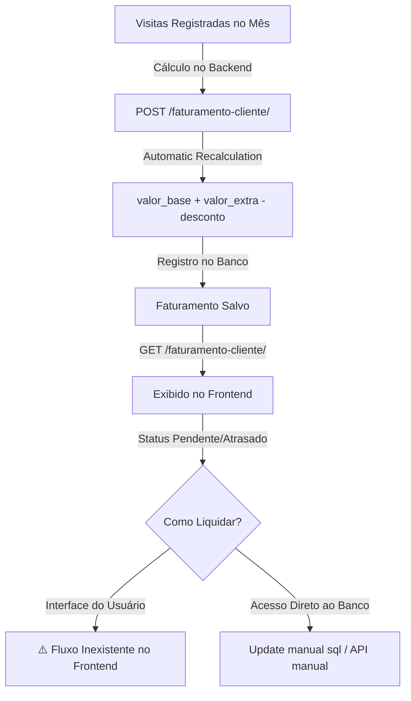

# Auditoria Técnico-Operacional — Módulo de Faturamento (AM Consultoria)

Esta auditoria apresenta uma análise profunda do módulo de **Faturamento de Clientes** do sistema da AM Consultoria, cruzando as APIs de backend (FastAPI), schemas, mappers, services do frontend (Next.js), fluxos operacionais de campo do Adriano e a ergonomia de uso em dispositivos móveis sob conexões instáveis.

---

## 1. Visão Geral Operacional

O módulo de **Faturamento** da AM Consultoria é o termômetro financeiro da operação. Ele é responsável por traduzir o trabalho realizado pelo Adriano em campo (visitas normais e extras) em cobranças recorrentes baseadas nas regras de cada contrato.

### O Diagnóstico Geral
*   **Camada de Escrita Totalmente Inativa no Frontend**: Embora a API do backend exponha endpoints robustos para criar faturamentos (`POST /faturamento-cliente/`) e aplicar atualizações parciais (`PATCH /faturamento-cliente/{id_faturamento}`), o frontend trata o faturamento de forma **100% passiva e de leitura**. O Adriano não possui nenhuma tela, botão ou modal para registrar o recebimento de uma fatura, aplicar descontos de cortesia ou lançar visitas extras do mês. O sistema funciona como um espelho de dados, sem controle ativo de caixa na interface.
*   **Gargalo Crítico de Rede (Vulnerabilidade N+1 Replicada)**: Para abrir o prontuário de um único contrato (`/contratos/[id]`), o frontend baixa a base de dados **inteira** de faturamentos de todos os clientes de todos os tempos (`GET /faturamento-cliente/`) e filtra em memória para encontrar a competência mais recente. À medida que o banco de dados cresce com os registros mensais, esse download massivo sobrecarregará o celular do Adriano em campo, resultando em lentidão extrema ou falhas de carregamento.
*   **Omissão de Dados Operacionais Críticos**: O campo `visitas_realizadas` (que o backend calcula automaticamente com base no histórico de visitas do mês) é mapeado pelo frontend, mas **totalmente ocultado na interface**. O Adriano é privado de ver a comprovação matemática do valor cobrado (ex: saber se a fatura do tipo "por visita" corresponds exatamente ao número de visitas que ele realizou).

---

## 2. Matriz de Cobertura de Campos (API vs. Frontend)

| Campo no PostgreSQL | Tipo de Dados | Mapper Frontend (`faturamento.mapper.ts`) | Usado na UI? | Estado Operacional / Impacto do Desperdício |
| :--- | :--- | :--- | :--- | :--- |
| `id_faturamento` | `SERIAL (PK)` | `id` (`string`) | **Sim** | Identificador único do registro financeiro. |
| `id_contrato` | `INT (FK)` | `contratoId` (`string`) | **Sim** | Vínculo estrutural com a versão ativa do contrato. |
| `mes_ano` | `DATE (CHECK dia 1)`| `mes_ano` (`string` YYYY-MM) | **Sim** | Exibido como competência mensal (ex: "Junho de 2026"). |
| `visitas_realizadas` | `INT` | `visitas_realizadas` (`number`) | ❌ **NÃO** | **Inteligência Ocultada:** Adriano não consegue validar na UI se a cobrança do mês bate com as visitas reais. Precisa contar manualmente no histórico. |
| `valor_base` | `DECIMAL(10,2)` | `valor_base` (`number`) | **Sim** | Exibido como valor fixo ou recorrente do contrato. |
| `valor_extra` | `DECIMAL(10,2)` | `valor_extra` (`number`) | **Sim** | Exibido como acréscimo de visitas extras efetuadas. |
| `desconto` | `DECIMAL(10,2)` | `desconto` (`number`) | **Sim** | Exibido como valor redutor. Mas é **estático**, sem tela para inserção. |
| `valor_total` | `DECIMAL(10,2)` | `valor_total` (`number`) | **Sim** | Exibido em destaque como o valor final de cobrança do cliente. |
| `pago` | `BOOLEAN` | `pago` (`boolean`) | **Sim** | Usado nos badges de status (`Pago`, `Pendente`, `Atrasado`). |
| `data_pagamento` | `DATE` | `data_pagamento` (`string`) | **Sim** | Exibido como a data de confirmação do Pix ou transferência. |

> [!WARNING]
> **Ponto Cego de Validação:** A ocultação do campo `visitas_realizadas` obriga o Adriano a agir como um "calculador humano" toda vez que abre o prontuário, cruzando mentalmente a lista de visitas executadas com o valor faturado para garantir que a API calculou os valores de forma correta.

---

## 3. Análise dos Fluxos Operacionais Reais



### A. A Recorrência e Fechamento Mensal
*   **O que a API faz**: O backend possui um motor inteligente em `faturamento_service.py` que calcula de forma dinâmica o faturamento de um contrato. Ele analisa se o tipo de pagamento é "Mensal" ou "Por Visita", conta as visitas executadas no período (excluindo visitas marcadas como extras) e soma o valor das visitas extras vigentes no contrato.
*   **O que o Frontend faz**: **Nada.** O frontend não expõe nenhuma funcionalidade de "Fechar Competência" ou "Gerar Faturamento do Mês". A criação de faturamentos depende de ações automatizadas rodando em segundo plano no servidor ou de inserts de sementes (seeds), removendo o controle de fechamento financeiro das mãos do operador.

### B. O Fluxo de Liquidação (Confirmar Pagamento)
*   **O Gargalo**: Quando o financeiro do cliente realiza a transferência bancária ou envia o Pix, o Adriano precisa marcar aquela fatura específica como **Paga**. 
*   No entanto, a interface não possui nenhum botão ou seletor de "Confirmar Recebimento" ou "Marcar como Pago". 
*   Embora o backend disponibilize o endpoint `PATCH /faturamento-cliente/{id_faturamento}` preparado para atualizar `pago: true` e registrar a `data_pagamento`, o frontend não implementou essa chamada. O Adriano fica com um painel de faturas vencidas que ele simplesmente **não consegue gerenciar** no dia a dia sem recorrer a intervenções técnicas manuais no banco de dados.

### C. Controle de Inadimplência e Atrasos
*   A página `/dashboard/financeiro/inadimplencia` possui uma segmentação ergonômica excelente em abas (`Todas`, `Pendentes`, `Vencidas`, `Pagas`).
*   No entanto, ela serve apenas como uma tela de consulta passiva. Um dashboard de inadimplência operacional de verdade deveria permitir ações de cobrança (ex: botão rápido para enviar lembrete via WhatsApp para o contato financeiro do cliente), mas hoje ele é um beco sem saída.

---

## 4. Gargalos Técnicos e Riscos Silenciosos

### Gargalo 1: Downloads Massivos Ineficientes em Rede Móvel (N+1 no Client-Side)
No arquivo [contrato.service.ts](file:///c:/Users/Windows-SSD/Desktop/Am-Consultoria/frontend/src/services/contrato.service.ts#L61-L69), o carregamento do prontuário do contrato faz a seguinte chamada:
```typescript
const [clienteRaw, faturamentos, visitas, todosContratosRaw, historicos] = await Promise.all([
  fetchApi<ClienteRaw>(`/clientes/${contrato.clienteId}`),
  fetchApi<FaturamentoRaw[]>('/faturamento-cliente/').then(data => data.map(mapFaturamento)),
  // ...
])
```
*   **Diagnóstico**: O frontend solicita a lista de **todos os faturamentos de todos os clientes de todos os tempos** (`/faturamento-cliente/`) e em seguida roda a função `getFaturamentoMaisRecente(faturamentos, id)` para obter o registro de faturamento daquele contrato específico.
*   **Por que isso é perigoso?** A tabela de faturamentos cresce acumulando pelo menos 1 novo registro por contrato a cada mês. Com 25 contratos ativos, o sistema gera 300 registros por ano. Em 2 anos, serão mais de 600 registros financeiros. Carregar esse payload gigante toda vez que o Adriano abre a página de detalhes de um único contrato em seu celular na estrada resultará em lentidão severa, estouro de memória e alto consumo de dados móveis.

### Gargalo 2: Data de Vencimento Fictícia Hardcoded na UI
No arquivo [faturamento.ts](file:///c:/Users/Windows-SSD/Desktop/Am-Consultoria/frontend/src/domain/faturamento.ts#L29-L35), a regra de status de atraso é definida assim:
```typescript
// Define o dia 10 do mês de referência como vencimento padrão fictício para cálculo de 'atrasado'
const [ano, mes] = f.mes_ano.split('-').map(Number)
const vencimento = new Date(ano, mes - 1, 10)

if (vencimento < hoje) return 'atrasado'
```
*   **Diagnóstico**: O sistema assume arbitrariamente que **toda fatura vence no dia 10** do mês. 
*   Na prática de consultoria em campo, diferentes clientes possuem diferentes ciclos de vencimento (vencimento no dia 5, dia 20, dia 30, ou 30 dias após a emissão). Como a tabela `faturamento_cliente` não possui um campo real de `data_vencimento`, a UI gera falsos avisos de "Inadimplência" para clientes que possuem acordos de pagamento em outras datas, desgastando o goodwill comercial.

---

## 5. Ergonomia Mobile e Usabilidade de Campo

O Adriano utiliza o sistema principalmente no smartphone, no intervalo entre visitas a clínicas e hospitais. O módulo de faturamento atual apresenta atritos ergonômicos significativos:

1.  **Cegueira Financeira Histórica no Prontuário**: A tela `/contratos/[id]` mostra exclusivamente o faturamento do mês atual. Se o Adriano quiser olhar a fatura do mês anterior (para confirmar se o cliente quitou a parcela de maio antes de entrar para a reunião de junho), ele **não consegue**. A página de detalhes do contrato não possui uma listagem histórica dos faturamentos daquele contrato.
2.  **Excesso de Cliques e Desvios de Fluxo**: Para contornar a cegueira histórica, o Adriano precisa:
    *   Sair do detalhe do contrato.
    *   Ir para o Dashboard.
    *   Entrar na seção Financeiro.
    *   Clicar em Inadimplência.
    *   Ir na aba "Todas" ou "Pagas".
    *   Fazer uma busca visual no meio de dezenas de faturas de outros clientes para achar o histórico desejado.
3.  **Falta de Ações Rápidas de Campo**: Quando o Adriano identifica uma fatura marcada como "Atrasada" no celular, ele não tem atalhos para atuar imediatamente. O fluxo ergonômico ideal de campo deveria oferecer um botão "Cobrar via WhatsApp" que gerasse uma mensagem automática para o responsável financeiro daquele cliente específico.

---

## 6. Inteligência Financeira Desperdiçada

A modelagem de dados da AM Consultoria é extremamente rica, mas a inteligência fica represada no backend. A UI poderia transformar números estáticos em ferramentas ativas de decisão:

*   **KPI de Valor Efetivo por Visita**: Dividindo o `valor_total` do faturamento pelas `visitas_realizadas`, o frontend poderia exibir a métrica de rentabilidade real do Adriano para cada cliente. 
    *   *Exemplo*: Se um cliente paga R$ 4.000,00 mensais fixos, mas consome 10 visitas no mês devido a intercorrências, a hora técnica do Adriano caiu para R$ 400,00 por visita. Se o cliente demandou apenas 4 visitas, a rentabilidade subiu para R$ 1.000,00 por visita. Essa informação é vital para negociações de reajuste.
*   **Alerta de Risco Operacional na Agenda**: Se um cliente acumula 2 faturas com status "Atrasado", o sistema deveria alertar o Adriano na página de Agenda e no perfil do cliente: 
    > ⚠️ **Operação de Risco Financeiro:** Este cliente possui 2 faturas vencidas em aberto. Avalie suspender visitas não emergenciais ou priorizar contato com o financeiro.
*   **Ausência de Projeção de Receita (MRR Ativo)**: Embora a tabela `projeto_parcelas` possua datas previstas e o faturamento seja mensal, a tela do Financeiro não oferece uma projeção simples de fluxo de caixa para os próximos 30/60 dias, forçando o Adriano a planejar suas finanças em planilhas externas.

---

## 7. Consistência Semântica e Terminologia

*   **Ambiguidade de "Inadimplência"**: A tela `/dashboard/financeiro/inadimplencia` possui uma aba para listar faturas com status "Pagas" (Liquidadas). Se a fatura está paga, ela não representa inadimplência de forma alguma. A página deveria chamar-se semanticamente **"Controle de Faturas"** ou **"Fluxo de Recebíveis"**, refletindo de forma precisa o ciclo de vida do faturamento.
*   **Data de Pagamento em Registros Pendentes**: Há faturamentos marcados como `pago = false` que possuem valores de data no banco, gerando inconsistências visuais de status. O domínio de faturamento precisa impor consistência estrita: se não está pago, a data de pagamento deve ser ignorada ou ocultada.

---

## 8. Avaliação Final Pragmática

### "O módulo de faturamento atual atende às necessidades reais do Adriano em campo?"

> [!IMPORTANT]
> **Veredito: Não.**
> Atualmente, o módulo de faturamento é uma **vitrine financeira estática**. Ele serve para o Adriano ver quanto faturou de forma geral, mas falha em ser uma ferramenta operacional útil na estrada. A falta de capacidade de confirmar pagamentos (dar baixa em faturas), a ocultação de visitas realizadas e o perigoso gargalo de rede que baixa toda a base de faturamento impedem que o sistema atue como o verdadeiro copiloto financeiro da AM Consultoria.
>
> **A Ponte para a Excelência Operacional:**
> Para transformar esse módulo em um software operacional de verdade, o frontend precisa cruzar a linha da passividade. Isso envolve:
> 1. Adicionar o botão de liquidação (PATCH) diretamente na UI.
> 2. Mostrar o histórico de faturamento completo no prontuário de cada contrato.
> 3. Resolver o download massivo parametrizando o fetch de faturamentos pelo ID do contrato.
> 4. Revelar o campo de visitas realizadas no mês para fins de auditoria de caixa.

---

## 9. Plano de Ação Recomendado (Sprint Financeira)

Para guiar as próximas evoluções da AM Consultoria, propõe-se o seguinte cronograma de melhorias incrementais seguras e frontend-first:

### Fase 1: Ergonomia de Escrita e Liquidação (Baixo esforço, Alto impacto)
*   **Ação**: Implementar os métodos `update` / `patch` em `FaturamentosService` chamando `PATCH /faturamento-cliente/{id}`.
*   **UI**: Inserir um botão ergonômico e discreto "Confirmar Recebimento" nos cards de faturas pendentes/vencidas (dentro do detalhe do contrato e na listagem geral). Ao clicar, abre um modal simples para selecionar a data do pagamento (padrão: hoje) e dispara o PATCH.
*   *Resultado*: O Adriano ganha a capacidade de gerenciar o fluxo de caixa diretamente pelo celular.

### Fase 2: Otimização de Rede e Prontuário 360 (Médio esforço, Alto impacto)
*   **Ação**: Criar um endpoint parametrizado no service ou passar o ID do contrato nas buscas de faturamento, eliminando a chamada de download global.
*   **UI**: Adicionar uma aba ou seção de "Histórico de Faturamento" no prontuário do contrato (`/contratos/[id]`), permitindo ver os meses anteriores daquele contrato específico com seus respectivos valores (Base, Extras, Descontos) e o indicador de `visitas_realizadas`.
*   *Resultado*: Carregamento instantâneo da página em redes de campo oscilantes e rastreabilidade total do histórico do cliente.

### Fase 3: Alertas Ativos e Segurança de Operação (Baixo esforço, Médio impacto)
*   **UI**: Integrar o status de inadimplência ativa com os alertas visuais no cabeçalho do cliente e da agenda, empoderando o Adriano com informações táticas antes do deslocamento físico.
*   *Resultado*: Redução de custos logísticos desnecessários com clientes inadimplentes.
